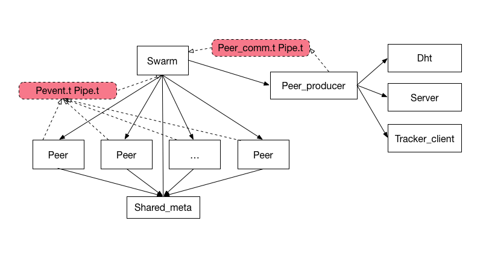
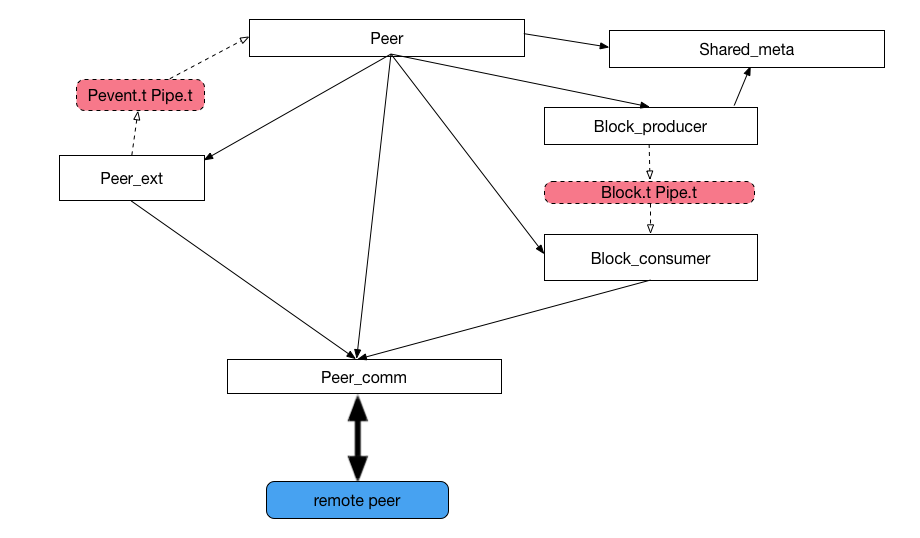

# Sawadee: A simple bittorrent client in OCaml/Async

Sawadee is an OCaml implementation of the bittorrent protocol, based on the `async` concurrency library. It still is in enfancy but may serve as a starting point for a more realistic bittorrent client. 

At the current stage, it is possible to download torrents and magnets from the command line, with some limitations. More precisely, the following BEP are *partially* supported:
* [BEP 3, Bittorrent Protocol Specification](http://bittorrent.org/beps/bep_0003.html),
* [BEP 5, Distributed Hash Table](http://bittorrent.org/beps/bep_0005.html),
* [BEP 9, Extension for Peers to Send Metadata Files](http://bittorrent.org/beps/bep_0009.html),
* [BEP 10, Extension Protocol](http://bittorrent.org/beps/bep_0010.html]),
* [BEP 20, Peer ID conventions](http://bittorrent.org/beps/bep_0020.html).

The code is divided into several libraries and executables. 
* `bittorrent` is the main library allowing the user to download torrents and (if `dht` is enabled) magnets,
* `dht` is the distributed hashtable library,
* `common` are modules common to both libraries as well as client modules,
* `sawadee` is a simple program to download a torrent/magnet from the command-line,
* `sawadee_repl` is a read-eval-print-loop to download torrent/magnet interactively, 

## Installation

### From `opam`

You will need `ocaml 4.05.0` and `opam` installed. Then Sawadee can be installed with:

    opam pin add https://github.com/phlalx/sawadee 

This should install all dependencies (notably `core` and `async`). The executables `sawadee`, `sawadee_repl` and `sawadee_rpc` should be available from the command-line.

### From scratch on Ubuntu

If you want to install everything from scratch on an Ubuntu VM, you can use the travis script `.travis-ci.sh`.

## Quick reminder and terminlogy

A *torrent* is a file that contains the information needed to download a file (or set of files) from other peers (abusively, we sometimes refer to torrent the actual data the user wishes to download). The torrent file contains:
* The URL of one or several *trackers*.
* The *info section* (or *metadata*) that contains the files names and sizes, and the *piece* size.

The torrent is uniquely identified by the 20-bytes SHA1 code of the info section of the torrent file. A *magnet* is an URI that contains this code (and possibly other parameters).

There are two ways to download a torrent.

### From a torrent file. 

Peers are returned by the tracker(s). Then, using bittorrent *peer wire protocol*, peers send eachother pieces of the files.

### From a magnet

In that case, only the SHA identifier is known. Neither the peers nor the metadata are known (the metadata can be retrived from a previous session though). Peers can be found via the DHT. Metadata can be found from the peers if they support the metadata extension. When both metadata and peers are available, downloading works as in the case of a torrent file.

## Usage

### `sawadee`

    > sawadee -h
    Download torrent/magnet

    sawadee URI/FILE

    === flags ===

    -l             set port
    -p             set download path
    [-v]           verbose (level = 1 or 2)
    [-build-info]  print info about this build and exit
    [-version]     print the version of this build and exit
    [-help]        print this help text and exit
                    (alias: -?)

The anonymous parameter is either a local torrent file, or the URI of a magnet. Download path specifies where to store downloaded files, metadata, logs, and the DHT routing table.  Files to be downloaded are created with their final size with the name specified in the torrent info section.

There are two types of metadata. 
* The info section, saved as `sha.torrent` where `sha` is the 40-bytes hexadecimal representation of the SHA1 identifier,
* and a bitfield, saved as `sha.bitfield`, which specify which pieces are already downloaded. 

The DHT module needs a table of DHT *nodes* addresses. It dynamically adds new nodes when running and save them across sessions. By default, the table is called `routing`. To bootstrap the system, a table is available in `./tests/`. It is not needed for simple torrent files where peers can be found from the tracker, but necessary for magnets.

The port is used for UDP and TCP connections (for communication with DHT nodes and bittorrent peers).

Example:

    # set up download directory and DHT table
    > mkdir download
    > cp tests/routing download/

    # download a torrent
    > sawadee -p download -l 7000 -v 2 tests/torrents/NuTyX_x86_64-20170625.torrent 

### `sawadee_repl`

The REPL uses the same options, but allows the user to launch and follow several downloads in parallel.

    > sawadee_repl -p download -l 7000
    # add tests/torrents/ubuntu-17.04-desktop-amd64.iso.torrent
    Added 59066769b9ad42da2e508611c33d7c4480b3857b.
    # list
    59066769b9ad42da2e508611c33d7c4480b3857b
    # help
    Commands are: 
    add
    seed
    list
    status 
    quit
    help
    # status 59066769b9ad42da2e508611c33d7c4480b3857b
    ubuntu-17.04-desktop-amd64.iso
    piece_length:    512kB
    total_length:   1534MB
    num_pieces: 3069
    downloaded = 0
    waiting for peers
    # quit

## Implementation

The system can be built with [jbuilder](http://jbuilder.readthedocs.io/en/latest/) using:

	jbuilder build @install

Executables will be found in `_build/install/default/bin`.

We give some hindsight on the global architecture. See the `ocamldoc` for more details (TODO: see how to build the doc using `jbuilder`?).

### Common

The `common` library defines datatypes used by the other librairies and client modules.  

`Hash_id` defines generic `SHA1`-based IDs that are specialized in three modules:
* `Node_id` defines DHT node IDs,
* `Peer_id` defines bittorrent peer IDs,
* `Bt_hash` defines torrent/magnet identifiers.

The bencode binary format is used extensively for data serialization in bittorrent (e.g. encoding of bittorrent messages, extension messages, torrent metadata, tracker messages). Encoding/decoding functions are defined in `Bencode_ext`, based on the [bencode](https://github.com/rgrinberg/bencode) library.

### DHT

The `dht` library implements distributed hash tables as specified in [BEP 5](http://bittorrent.org/beps/bep_0005.html). It is a service/daemon used by bittorrent to found peers. The interface used by the local peer is given in `Dht.mli`. DHT nodes communicate with eachother using a simple UDP-based RPC-protocol.

### Bittorrent

This is the main library. The library interface is given by module `Bittorrent`. The following modules are singletons:

* `Bittorrent` library interface, 
* `Dht` interface to the DHT, 
* `Server` TCP server waiting for peer connections,
* `Torrent_table`, keeps track of torrents being downloaded (maps `Bt_hash.t` to `Swarm.t`). 

#### Swarm

For each torrent to download, a `Swarm.t` is created. A swarm controls a set of `Peer.t`. A `Peer.t` is a worker whose job is to interact with remote peer. The swarm has two main functions:
* it controls the workers with high-level command such as `start` or `stop`, 
* it controls when peers can join, by *consuming* peers from a `Peer_producer.t`.

Peers notify the swarm with asynchronous events (a piece has been downloaded, the peer is leaving, metadata has been found...).

At any given time, the Swarm and the peers can be in one of two states:
* metadata isn't known, in that case they request it from the remote peers,
* metadata is known, and they try to download pieces of the torrent  

Once in the second state, all the peers and the swarm share a `Shared_meta.t` value which contains:
* information about the files (what has been downloaded, buffers in memory)
* pieces already requested

This can be summarized by the following figure:

#### Peer

A peer worker delegates work to other modules. 
* `Peer_comm.t` is the lower layer interface responsible to send/receive messages (`Message.t` and `Extension.t`) to the remote peer. It also implements the handshaking protocol. 
* All extension messages (BEP 9 and 10) are processed by a `Peer_ext.t`, which notifies back the controlling peer using a pipe. We only deal with hanshake and metadata extension.
* `Block_producer.t` and `Block_consumer.t` are used to control the flow of blocks requested. 

Let's try to clarify the last item. Bittorrent peers advertise pieces, but the unit of transmission is smaller (we call it a block). Typically, a piece is made of dozens of blocks. Besides, we aim at keeping a constant number of pending block requests. Some experimentation is required to figure out a correct number, but following the implementation guidelines, it's currently less than 10.  (TODO complete this).

### Front-ends and RPCs

The front-ends `sawadee`, `sawdee_repl` and `sawadee_rpc` are simple wrappers around the `bittorrent` library. `sawadee_rpc` implements an rpc server using the `Async.Rpc`. 

### Tests

It is hard to come by with diverse system test cases. Legal torrents (such as linux distributions) usually have few seeders and even fewer leeches. Torrent files in general are harder to find as people favor magnets. Readily-available magnets with many peers and a variety of clients are usually illegal. Besides, these tests are not reproductible as they are dynamic in nature. Local system testing is tedious as it requires more scripting and tools. We provide the following tests but they need to be improved and extended.

#### Unit and integration tests

* `common/test/test_bitfield.ml`
* `dht/test/test_krpc_packet.ml`
* `dht/test/test_dht.ml`

The first two are simple `Ounit` tests for the corresponding module. The last one is an integration test for the DHT. 

They are bound to the `runtest` directive in `jbuilder`. They can be ran with `jbuilder runtest`.

#### System tests

Test scripts `./scripts/`.  

The script `./bt_test.sh` tests downloading of a torrent file. It runs a number of clients and a tracker. Each client is initialized with partially downloaded files (as specified by a random bitfield) in its download directory. It gets peers addresses from the tracker and proceeds to download. Test passes if all pieces are downloaded. Bittorrent clients are run as rpc servers using `sawadee_rpc`. They are commanded by a rpc client (`test_rpc/test_simple_torrent.ml`).

Parameters such as the number of clients and ports can be customized in `./scripts/test_env.sh`. Here is a sample execution with 5 clients:

    > bt_test.sh 
    cleaning up
    rm -rf download0
    rm -rf download1
    rm -rf download2
    rm -rf download3
    rm -rf download4
    rm -rf download5
    pkill -f sawadee
    pkill -f test_dht
    pkill -f test_simple_torrent
    pkill -f sawadee_rpc
    pkill -f bt_tracker
    setting up tests
    setting up dir download0
    scripts/gen_bitset.py download0/e816b060122c95fa171e41227b12b4a8f30c4e20.bitset 
    setting up dir download1
    scripts/gen_bitset.py download1/e816b060122c95fa171e41227b12b4a8f30c4e20.bitset 
    setting up dir download2
    scripts/gen_bitset.py download2/e816b060122c95fa171e41227b12b4a8f30c4e20.bitset 
    setting up dir download3
    scripts/gen_bitset.py download3/e816b060122c95fa171e41227b12b4a8f30c4e20.bitset 
    setting up dir download4
    scripts/gen_bitset.py download4/e816b060122c95fa171e41227b12b4a8f30c4e20.bitset 
    setting up dir download5
    scripts/gen_bitset.py download5/e816b060122c95fa171e41227b12b4a8f30c4e20.bitset 
    starting tracker on port 6969
    starting rpc server on port -l 6000 -r 7000
    starting rpc server on port -l 6001 -r 7001
    starting rpc server on port -l 6002 -r 7002
    starting rpc server on port -l 6003 -r 7003
    starting rpc server on port -l 6004 -r 7004
    starting rpc server on port -l 6005 -r 7005
    _build/install/default/bin/test_simple_torrent -r 7000 -n 6 -s 25 tests/torrents/multifiles_localhost_6969.torrent
    Peer 7001: 66/66
    Peer 7004: 66/66
    Peer 7000: 66/66
    Peer 7002: 66/66
    Peer 7003: 66/66
    Peer 7005: 66/66
    Test OK

The torrent file `multifile_localhost_6969.torrent` has been generated beforehand using the folder `tests/multifiles`.

The other test is `./scripts/bt_test_dht.sh`. It is similar to the previous one and uses the same `test_env.sh` parameters. It relies on DHT to find peers instead of the tracker. One of the bittorrent client is asked to seed a file. It will announce itself on the DHT which let the other peers find it.

    > bt_test_dht.sh 
    cleaning up
    rm -rf download0
    rm -rf download1
    rm -rf download2
    rm -rf download3
    rm -rf download4
    rm -rf download5
    pkill -f sawadee
    pkill -f test_dht
    pkill -f test_simple_torrent
    pkill -f sawadee_rpc
    pkill -f bt_tracker
    setting up tests
    setting up dir download0
    scripts/gen_bitset.py download0/e816b060122c95fa171e41227b12b4a8f30c4e20.bitset 
    setting up dir download1
    scripts/gen_bitset.py download1/e816b060122c95fa171e41227b12b4a8f30c4e20.bitset 
    setting up dir download2
    scripts/gen_bitset.py download2/e816b060122c95fa171e41227b12b4a8f30c4e20.bitset 
    setting up dir download3
    scripts/gen_bitset.py download3/e816b060122c95fa171e41227b12b4a8f30c4e20.bitset 
    setting up dir download4
    scripts/gen_bitset.py download4/e816b060122c95fa171e41227b12b4a8f30c4e20.bitset 
    setting up dir download5
    scripts/gen_bitset.py download5/e816b060122c95fa171e41227b12b4a8f30c4e20.bitset 
    starting tracker on port 6969
    starting rpc server on port -l 6000 -r 7000
    starting rpc server on port -l 6001 -r 7001
    starting rpc server on port -l 6002 -r 7002
    starting rpc server on port -l 6003 -r 7003
    starting rpc server on port -l 6004 -r 7004
    starting rpc server on port -l 6005 -r 7005
    _build/install/default/bin/test_dht -r 7000 -n 6 -s 60 tests/multifiles/11318.jpg
    Peer 7004: 3/3
    Peer 7003: 3/3
    Peer 7002: 3/3
    Peer 7001: 3/3
    Peer 7005: 3/3
    Test OK

#### Travis

All the tests are run in the travis script `./travis-ci.sh`.

## Roadmap

First, consolidate the current implementation.
* lots of TODOs in the code. Mainly little improvements here and there.
* more testing and documentation
* improve logging and traces
* improve error management. Distinguish between sources of errors
  * badly behaved remote peers
  * fatal errors
  * internal errors that can be recovered

Then add missing features to fully support the BEP listed above. This includes:
* Implementing *unchoking* strategy. Currently, we unchoke every interested peers, but we should limit their number and pick them according to some *merit* metric, 
* dealing with end of download. We should request the same blocks to different peers, and then cancel requests if needed, 
* correctly implementing the DHT table (in particuler the *bucket* and *token* mechanism).

## License

## Resources and libs

* Wikipedia [bittorrent](https://en.wikipedia.org/wiki/BitTorrent) and [DHT](https://en.wikipedia.org/wiki/Distributed_hash_table),
* bittorrent [official](http://bittorrent.org/beps/bep_0000.html) and [unoffical](https://wiki.theory.org/index.php/Main_Page) specification,
* Wireshark tool (packet sniffer, useful to debug protocol) and [bittorrent dissector](https://wiki.wireshark.org/BitTorrent),
* OCaml Core and Async ([0.9](https://ocaml.janestreet.com/ocaml-core/v0.9/doc/)) ,
* [bin_prot](https://github.com/janestreet/bin_prot),
* [bencode](https://github.com/rgrinberg/bencode),
* [cohttp-async](https://github.com/mirage/ocaml-cohttp),
* [sha](https://github.com/vincenthz/ocaml-sha)